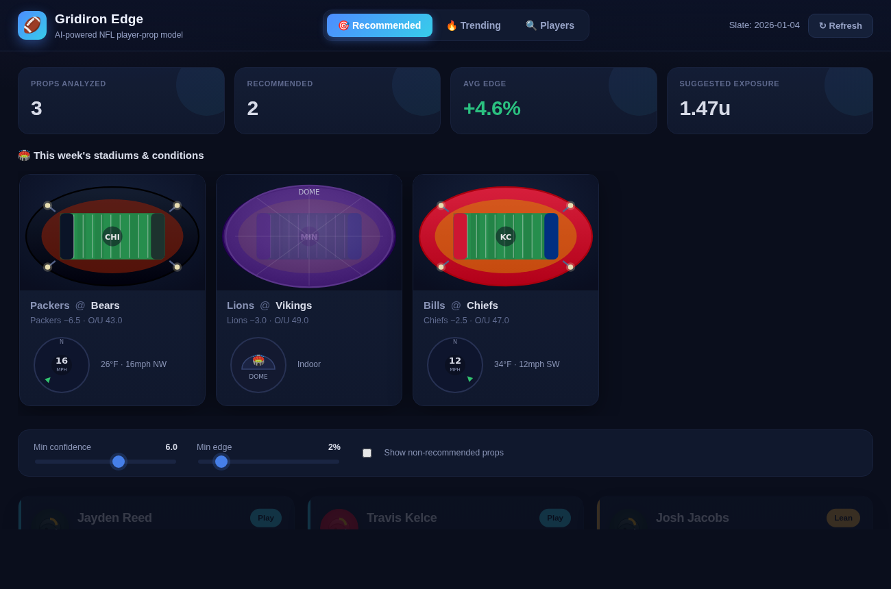

# 🏈 Gridiron Edge — AI-Powered NFL Prop Engine

An NFL player-prop analytics engine that ingests player form, defensive matchups,
weather and injuries, projects each prop, prices it against the sportsbook line,
and surfaces only the bets where the model believes the book is **mispriced** —
with a plain-English explanation for every pick.

This repository is the **working brain** of that platform. It runs end-to-end
today on realistic sample data, with clean seams where live data sources plug in.

> ⚠️ **Model output, not betting advice.** The bundled slate uses illustrative,
> fictional numbers. Gamble responsibly. 21+.



---

## Quick start

No dependencies — just Python 3.9+.

```bash
# 1. Generate recommendations from the sample slate
python3 generate.py

# 2. Launch the dashboard (live API recalculates on every request)
python3 server.py
# → open http://localhost:8000
```

Tighten the model from the CLI or the UI sliders:

```bash
python3 generate.py --min-confidence 7 --min-edge 4
```

---

## How it works

Each prop flows through a pipeline of small, independently testable stages:

```
 slate (stats + lines + weather + injuries)
        │
        ▼
  ┌─────────────┐   recent-form blend: last 1/3/5/10, season,
  │  form.py    │   career, opponent history → base mean + variance + trend
  └─────────────┘
        │
        ▼
  ┌─────────────┐   opponent defense vs position, game script
  │ matchup.py  │   (spread), game total → multiplier
  └─────────────┘
        │
  ┌─────────────┐   wind / rain / snow / cold → per-market multiplier
  │ weather.py  │
  └─────────────┘
        │
  ┌─────────────┐   own-player injury flag + knock-on effects
  │ injuries.py │   (elite CB out → WR up, LT out → QB down, DT out → RB up)
  └─────────────┘
        │
        ▼
  ┌─────────────┐   final projected mean + std (variance floors keep it honest)
  │projection.py│
  └─────────────┘
        │
        ▼
  ┌─────────────┐   best line across books → hit probability (normal model)
  │ betting.py  │   → de-vigged edge → EV → 0–10 confidence → fractional-Kelly stake
  └─────────────┘
        │
        ▼
  ┌─────────────┐   min-confidence / min-edge / injury-hold rules
  │  rules.py   │
  └─────────────┘
        │
        ▼
  ┌─────────────┐   headline + one-line summary + ranked "why" bullets
  │ explain.py  │
  └─────────────┘
```

### The betting math

- **Hit probability** — the projection is a Normal(μ, σ). For an *Over L*,
  `P(hit) = P(X > L) = 1 − Φ((L − μ)/σ)`, computed with `math.erf` (no numpy needed).
- **Edge** — the book's two-way price is **de-vigged** so the implied
  probabilities sum to 1.0; `edge = P(model) − P(book)`.
- **Line shopping** — across DraftKings, FanDuel, BetMGM, Caesars and ESPN BET
  the engine picks the most bettor-friendly number, breaking ties on price.
- **Confidence (0–10)** — driven by edge, discounted for thin samples and high
  variance, so a big edge on two games of data does **not** score like a big
  edge on a full season.
- **Stake** — quarter-Kelly, capped, for bankroll safety.

### Betting discipline (rules engine)

- Only recommend above a confidence **and** edge threshold.
- **Hold any prop whose own player is QUESTIONABLE / DOUBTFUL / GTD** until
  inactives confirm status — even when the raw edge looks great. (See Rashee
  Rice in the sample slate: +9% edge, still benched.)

---

## Project layout

```
engine/
  models.py       dataclasses for players, defenses, weather, injuries, lines
  statmath.py     normal CDF, weighted mean, std (stdlib only)
  odds.py         American odds, de-vig, EV, best-line shopping
  form.py         recent-form blending + trend detection
  weather.py      weather → per-market multipliers
  injuries.py     own-player flags + knock-on matchup effects
  matchup.py      defense-vs-position + game-script adjustments
  projection.py   assembles the final mean + std
  betting.py      hit prob, edge, confidence, stake, grade
  rules.py        recommend / hold decisions
  explain.py      human-readable reasoning
  pipeline.py     orchestrates the whole slate
  sources/
    fetch.py      cached HTTP CSV fetch (stdlib, proxy-aware, gzip)
    nflverse.py   real nflverse → Slate (schedules, weather, stats, defenses)
data/
  sample_slate.json   illustrative slate (7 props across 3 games)
  cache/              downloaded feeds (git-ignored)
web/                  dashboard (vanilla HTML/CSS/JS, no build step)
generate.py           CLI → run the model on the sample slate
nfl_build.py          CLI → build a real nflverse slate and run the model
server.py             stdlib web server + live /api/recommendations
tests/                offline unit tests (engine math + nflverse mapping)
```

---

## Real nflverse data

The engine can build slates from **live nflverse data** instead of the sample
file — same math, real inputs:

```bash
python3 nfl_build.py 2024 5 --games-only   # real games + weather (no stats needed)
python3 nfl_build.py 2024 5                 # full model (needs weekly stats, see below)
python3 nfl_build.py 2024 5 --out web/data/recommendations.json
```

`engine/sources/nflverse.py` is the adapter. What it pulls, and from where:

| Feed                         | Source                                   | Reachable from a standard egress env |
|------------------------------|------------------------------------------|--------------------------------------|
| Games, weather, spread, total | nflverse `games.csv` (git tree)          | ✅ yes — live                        |
| Rosters (player→team/pos)     | nflverse `rosters.csv` (git tree)        | ✅ yes — live                        |
| Weekly player stats           | nflverse-data **GitHub releases**        | ⚠️ often blocked by egress policy    |
| Sportsbook prop lines         | *(no free nflverse source — needs odds API)* | ➖ proxy line used for now        |

- **Schedules/weather/market totals load live** and feed the game-script and
  weather modules directly (real temp, wind, dome/roof, spread, total).
- **Weekly stats** (per-player game logs + computed defense-vs-position
  profiles) come from nflverse *release* assets. Where GitHub release traffic is
  blocked, export them once and drop the CSV at
  `data/cache/player_stats_<season>.csv` — the loader picks it up automatically:

  ```python
  import nfl_data_py as nfl
  nfl.import_weekly_data([2024]).to_csv("data/cache/player_stats_2024.csv", index=False)
  ```
- **Defense profiles are computed**, not hand-entered: the loader aggregates
  what each team allows to QBs / WRs / TEs / RBs (rush & receiving) from the
  weekly box scores and expresses it relative to league average.
- **Lines**: nflverse has no player-prop lines, so each prop currently gets a
  *proxy* line at the player's recent-form baseline. This shows how far the
  matchup/weather model moves the projection off baseline; swap in an odds feed
  (below) for edges against real books.

## The road to live data

The engine is decoupled from its sources by one seam — a `Slate` (from the
sample file *or* `engine/sources/nflverse.py`). Remaining adapters to add:

| Concern            | Suggested source                                             | Status |
|--------------------|--------------------------------------------------------------|--------|
| 3–5 yrs of stats   | **nflverse** (`nfl_data_py` / release CSVs)                  | ✅ integrated (release-gated) |
| Weather            | nflverse schedules (temp/wind/roof)                          | ✅ integrated; add precip via a weather API |
| Sportsbook lines   | **The Odds API** or a books aggregator (7-book comparison)   | ➖ next |
| Injuries           | nflverse injuries release + a news feed for game-time calls  | ➖ next |

Planned next phases (not yet built):

1. **Historical database** — persist the full per-player metric set (air yards,
   time to throw, YAC, route participation, target share, red-zone usage …) and
   team offense/defense splits described in the project vision.
2. **Learned coefficients** — replace the hand-tuned weather/matchup multipliers
   with values fit on the historical database (gradient-boosted or ridge model).
3. **Live recalculation** — re-run projections on injury news and line moves;
   detect steam / reverse line movement and closing-line value.
4. **Correlation & parlay rules**, referee tendencies, travel/rest, and
   market-vs-model sentiment.

---

## Testing the model quickly

```bash
python3 generate.py            # see the ranked slate in your terminal
python3 -m pytest              # (add tests under tests/ as the model grows)
```
