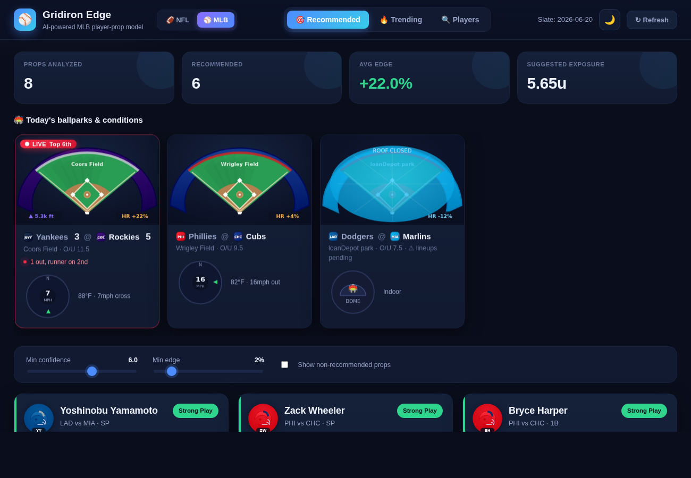

# Qellys Book — a multi-sport betting model

A player-prop and game-bet analytics engine covering NFL, college football,
MLB, NBA, WNBA and UFC,
plus Polymarket flow and fantasy football. It ingests player form, matchups,
weather and injuries, projects each market, prices it against the sportsbook
line, and surfaces only the bets where the model believes the book is
**mispriced** — with a plain-English explanation for every pick, and every
pick journaled at its real price and graded on the Record page.

This repository is the **working brain** of that platform. It runs end-to-end
today on realistic sample data, with clean seams where live data sources plug in.

> ⚠️ **Model output, not betting advice.** The bundled slate uses illustrative,
> fictional numbers. Gamble responsibly. 21+.


---

## Quick start

No dependencies — just Python 3.9+.

```bash
# 1. Generate recommendations from the sample slate
python3 generate.py

# 2. Launch the dashboard (live API recalculates on every request)
python3 server.py
# → open http://localhost:8000
```

For real NFL/MLB data, live odds and the historical database, see **[SETUP.md](SETUP.md)**.

Tighten the model from the CLI or the UI sliders:

```bash
python3 generate.py --min-confidence 7 --min-edge 4
```

## Dashboard

A three-tab single-page app (no build step), styled with a cohesive dark design
system and all artwork drawn as self-contained SVG (no external images — works
offline and under a strict CSP). Tabs are hash-routed, so `#trending` and
`#players` are shareable links.

- **🎯 Recommended** — summary tiles (animated count-up), the "this week's
  stadiums" strip, threshold sliders, and the ranked pick cards: projection-vs-
  line bar, hit-prob / edge / EV metrics, an animated confidence meter,
  line-shopping badge (`N books · best <book>`), trend, stake, and the model's
  reasons.
- **🔥 Trending** — three league-wide leaderboards derived from real model
  signals (not betting handle): biggest recent-form risers, cooling-off fallers,
  and biggest edges — each row with a color-coded sparkline. Click a row to jump
  to that player.
- **🔍 Players** — search any player to pull up a profile: form tiles
  (L1/L3/L5/L10/season), a game-log **sparkline with the prop line drawn**
  (green dots beat the line, red missed), the full game log, and the active pick.

Visual details:

- **Light / dark themes** — a toggle in the header (persisted to `localStorage`,
  or force one with `?theme=light`). The chrome flips to a light palette; the
  stadium/wind SVGs stay dark on purpose, reading as broadcast-style media cards.
- **Aerial stadiums** — a stylized top-down stadium per game whose roof (dome /
  retractable / open), surface (grass vs turf) and stands are colored from real
  nflverse team colors, with end-zone team labels, hash marks and goalposts.
- **Animated wind gauge** — streamlines flow in the wind's direction and speed
  up with real wind speed; dome games show a climate badge.
- **Player avatars & real headshots** — a team-colored helmet avatar beside
  each name (stylized mark, not a likeness). When a slate is built from real
  nflverse stats, each player's official `headshot_url` flows through the
  pipeline and the photo layers over the helmet automatically — failing images
  remove themselves, so the helmet always shows through offline.
- **Team logo marks** — procedural team-color monograms in game matchup lines
  and player-profile headers.
- **Motion** — staggered scroll-reveal (IntersectionObserver), pointer-tilt on
  the stadium cards, projection bars that draw in, a radar "ping" on each
  player's latest game, grade-colored hover glow, and a logo sheen. All honor
  `prefers-reduced-motion`, and `?static` disables entrance motion for
  repeatable screenshots.

> On real player likenesses: generating photoreal/cartoon faces of specific
> players isn't done here (capability + likeness rights). The avatar system is
> built to accept official headshot URLs instead. Wind *direction* and
> precipitation aren't in the nflverse feed either — wire a weather API to fill
> those; wind *speed*, roof and surface are real.

---

## How it works

Each prop flows through a pipeline of small, independently testable stages:

```
 slate (stats + lines + weather + injuries)
        │
        ▼
  ┌─────────────┐   recent-form blend: last 1/3/5/10, season,
  │  form.py    │   career, opponent history → base mean + variance + trend
  └─────────────┘
        │
        ▼
  ┌─────────────┐   opponent defense vs position, game script
  │ matchup.py  │   (spread), game total → multiplier
  └─────────────┘
        │
  ┌─────────────┐   wind / rain / snow / cold → per-market multiplier
  │ weather.py  │
  └─────────────┘
        │
  ┌─────────────┐   own-player injury flag + knock-on effects
  │ injuries.py │   (elite CB out → WR up, LT out → QB down, DT out → RB up)
  └─────────────┘
        │
        ▼
  ┌─────────────┐   final projected mean + std (variance floors keep it honest)
  │projection.py│
  └─────────────┘
        │
        ▼
  ┌─────────────┐   best line across books → hit probability (normal model)
  │ betting.py  │   → de-vigged edge → EV → 0–10 confidence → fractional-Kelly stake
  └─────────────┘
        │
        ▼
  ┌─────────────┐   min-confidence / min-edge / injury-hold rules
  │  rules.py   │
  └─────────────┘
        │
        ▼
  ┌─────────────┐   headline + one-line summary + ranked "why" bullets
  │ explain.py  │
  └─────────────┘
```

### The betting math

- **Hit probability** — the projection is a Normal(μ, σ). For an *Over L*,
  `P(hit) = P(X > L) = 1 − Φ((L − μ)/σ)`, computed with `math.erf` (no numpy needed).
- **Edge** — the book's two-way price is **de-vigged** so the implied
  probabilities sum to 1.0; `edge = P(model) − P(book)`.
- **Line shopping** — across DraftKings, FanDuel, BetMGM, Caesars and theScore Bet
  the engine picks the most bettor-friendly number, breaking ties on price.
- **Confidence (0–10)** — driven by edge, discounted for thin samples and high
  variance, so a big edge on two games of data does **not** score like a big
  edge on a full season.
- **Stake** — quarter-Kelly, capped, for bankroll safety.

### Betting discipline (rules engine)

- Only recommend above a confidence **and** edge threshold.
- **Hold any prop whose own player is QUESTIONABLE / DOUBTFUL / GTD** until
  inactives confirm status — even when the raw edge looks great. (See Rashee
  Rice in the sample slate: +9% edge, still benched.)

---

## Project layout

```
engine/
  models.py       dataclasses for players, defenses, weather, injuries, lines
  statmath.py     normal CDF, weighted mean, std (stdlib only)
  odds.py         American odds, de-vig, EV, best-line shopping
  form.py         recent-form blending + trend detection
  weather.py      weather → per-market multipliers
  injuries.py     own-player flags + knock-on matchup effects
  matchup.py      defense-vs-position + game-script adjustments
  projection.py   assembles the final mean + std
  betting.py      hit prob, edge, confidence, stake, grade
  rules.py        recommend / hold decisions
  explain.py      human-readable reasoning
  pipeline.py     orchestrates the whole slate
  backtest.py     walk-forward backtest: calibration, Brier/ECE, ROI, CLV
  db.py           historical database (SQLite): games + player_game_logs
  ingest.py       ingestion pipeline: sources -> history DB
  ledger.py       bet-tracking ledger + bankroll (self-evaluation loop)
  linemoves.py    line-movement history + steam detection
  accounts.py     email/password accounts, scrypt verifiers, sessions
  billing.py      Stripe webhook verification + entitlement state
  ml/
    features.py   shared feature extraction (train + inference)
    model.py      pure-Python ridge regression + serialized MultiplierModel
    train.py      walk-forward example assembly + per-market fitting
  sources/
    fetch.py      cached HTTP CSV fetch (stdlib, proxy-aware, gzip)
    nflverse.py   real nflverse → Slate (schedules, weather, stats, defenses)
    oddsapi.py    The Odds API → real book lines (de-vig, best-line shopping)
    injuries.py   nflverse injury reports → holds + knock-on effects
    depthcharts.py  nflverse depth charts → role refinement, backup demotion
data/
  sample_slate.json   illustrative slate (7 props across 3 games)
  cache/              downloaded feeds (git-ignored)
web/                  3-tab dashboard (vanilla HTML/CSS/JS, no build step)
  js/app.js           router + Recommended / Trending / Players views
  js/teams.js         NFL team colors + names (from nflverse)
  js/visuals.js       SVG art: avatars, wind gauge, aerial stadiums, sparklines
generate.py           CLI → run the model on the sample slate
nfl_build.py          CLI → build a real nflverse slate and run the model
server.py             stdlib web server + live /api/recommendations
deploy/               Caddy + systemd units, deploy and backup scripts
tests/                offline unit tests (engine math + nflverse mapping)
```

This is the NFL core, which is what the rest of this README documents. The
other sports, the fantasy tools, the meme-coin tracker and the learning
ladder bring `engine/` to 187 modules in total — `python3 launch.py --check`
reports which of them are actually wired up and answering at any moment.

---

## Real nflverse data

The engine can build slates from **live nflverse data** instead of the sample
file — same math, real inputs:

```bash
python3 nfl_build.py 2024 5 --games-only   # real games + weather (no stats needed)
python3 nfl_build.py 2024 5                 # full model (needs weekly stats, see below)
python3 nfl_build.py 2024 5 --injuries      # real injury holds + knock-on effects
python3 nfl_build.py 2024 5 --odds          # price against real sportsbook lines
python3 nfl_build.py 2024 5 --injuries --odds --out web/data/recommendations.json
```

`engine/sources/nflverse.py` is the adapter. What it pulls, and from where:

| Feed                         | Source                                   | Reachable from a standard egress env |
|------------------------------|------------------------------------------|--------------------------------------|
| Games, weather, spread, total | nflverse `games.csv` (git tree)          | ✅ yes — live                        |
| Rosters (player→team/pos)     | nflverse `rosters.csv` (git tree)        | ✅ yes — live                        |
| Weekly player stats           | nflverse-data **GitHub releases**        | ⚠️ often blocked by egress policy    |
| Sportsbook prop lines         | *(no free nflverse source — needs odds API)* | ➖ proxy line used for now        |

- **Schedules/weather/market totals load live** and feed the game-script and
  weather modules directly (real temp, wind, dome/roof, spread, total).
- **Weekly stats** (per-player game logs + computed defense-vs-position
  profiles) come from nflverse *release* assets. Where GitHub release traffic is
  blocked, export them once and drop the CSV at
  `data/cache/player_stats_<season>.csv` — the loader picks it up automatically:

  ```python
  import nfl_data_py as nfl
  nfl.import_weekly_data([2024]).to_csv("data/cache/player_stats_2024.csv", index=False)
  ```
- **Defense profiles are computed**, not hand-entered: the loader aggregates
  what each team allows to QBs / WRs / TEs / RBs (rush & receiving) from the
  weekly box scores and expresses it relative to league average.
- **Lines**: nflverse has no player-prop lines. Without `--odds` each prop gets
  a *proxy* line at the player's recent-form baseline (shows how far the model
  moves off baseline); with `--odds` real book lines replace it.

## Real sportsbook lines (The Odds API)

`engine/sources/oddsapi.py` pulls live NFL player props (pass/rush/receiving
yards, receptions) across DraftKings, FanDuel, BetMGM, Caesars, theScore Bet,
Fanatics and Hard Rock, and attaches them to the slate — so the model prices
its projections against **real books** and shops the best number.

```bash
export ODDS_API_KEY=your_key      # free key at https://the-odds-api.com
python3 nfl_build.py 2024 5 --odds
```

- Matches Odds API events to slate games by team, then props by normalized
  player name + market (handles `Amon-Ra St. Brown`, `… Jr.`, etc.).
- Pairs each Over with its Under so the **de-vig** has both sides; `best_over_line`
  then shops the lowest line across books.
- Player props are event-scoped (one request per game), so responses are cached
  briefly under `data/cache/` and the remaining API quota is printed each run.
- Restrict books with `--books draftkings,fanduel,betmgm`.

> Note: some managed/sandboxed environments block outbound access to
> `api.the-odds-api.com`; run `--odds` where the host is reachable.

## Real injury reports (nflverse)

`engine/sources/injuries.py` feeds the injury module with nflverse's weekly
injury reports:

```bash
python3 nfl_build.py 2024 5 --injuries
```

- **Own-player holds** (the headline): any prop on a player listed
  Questionable / Doubtful / Out / IR is suppressed by the rules engine and
  reported — the discipline rule, now on real data.
- **Knock-on effects**: an opposing DT/NT or offensive tackle ruled out shifts
  the affected rush/pass projections.
- Same release-gated delivery as weekly stats, with the same
  `data/cache/injuries_<season>.csv` fallback:

  ```python
  import nfl_data_py as nfl
  nfl.import_injuries([2024]).to_csv("data/cache/injuries_2024.csv", index=False)
  ```

> Caveat: the report gives a player's position but no depth-chart / coverage
> detail. Add `--depth` (below) to refine that; distinguishing an *elite* CB
> from an average starter still needs a grades source (future work). The
> own-player hold needs none of that.

## Depth charts (`--depth`)

`engine/sources/depthcharts.py` sharpens the injury knock-on effects using
nflverse weekly depth charts:

```bash
python3 nfl_build.py 2024 5 --injuries --depth
```

- **Role refinement**: a ruled-out "T" becomes specifically the **LT** (blind
  side) or RT; a "CB" becomes the boundary starter (`cb1`) or the
  **nickel/slot corner** (`slot_cb`), which changes *which* receivers get the
  boost.
- **Backup demotion**: a ruled-out player who isn't the starter
  (`depth_team > 1`) stops triggering knock-on adjustments entirely — a swing
  tackle being out shouldn't move the QB's projection.
- Same release-gated delivery, with the `data/cache/depth_charts_<season>.csv`
  fallback (`nfl.import_depth_charts([2024])`).

## Line movement & steam detection

Every `--odds` run appends a timestamped snapshot of each book's lines to
`data/cache/line_history.jsonl`. Across repeated runs, `engine/linemoves.py`
turns that history into a movement report printed after the slate:

```
Line movement (open → current):
  ▲ Josh Jacobs rush_yds: 70.5 → 72 (+1.5)  🔥 STEAM
  ▼ Josh Allen pass_yds: 250.5 → 245 (-5.5)
```

- **Open vs current** per book and as a consensus (median across books).
- **Steam detection**: several books moving the same direction by ≥0.5 within
  an hour — the classic footprint of sharp money.
- Consecutive identical snapshots are deduped, so cached re-runs never
  fabricate movement.
- Reverse line movement (line vs public %) needs public-betting data, which has
  no free feed — future work.

## The road to live data

The engine is decoupled from its sources by one seam — a `Slate` (from the
sample file *or* `engine/sources/nflverse.py`). Remaining adapters to add:

| Concern            | Suggested source                                             | Status |
|--------------------|--------------------------------------------------------------|--------|
| 3–5 yrs of stats   | **nflverse** (`nfl_data_py` / release CSVs)                  | ✅ integrated (release-gated) |
| Weather            | nflverse schedules (temp/wind/roof)                          | ✅ integrated; add precip via a weather API |
| Sportsbook lines   | **The Odds API** (7-book comparison + de-vig)               | ✅ integrated (`--odds`) |
| Injuries           | nflverse weekly injury reports (holds + knock-on)           | ✅ integrated (`--injuries`) |

Planned next phases:

1. **Backtest & calibration harness** — ✅ done (`backtest.py`); measure Brier /
   ECE / ROI before tuning anything.
2. **Learned coefficients** — ✅ done (`train_model.py`, `engine/ml/`); ridge
   model of the form-baseline multiplier, validated against the backtest.
3. **Depth charts** — ✅ done (`--depth`); LT vs RT, boundary vs slot CB, and
   backup demotion. Elite-vs-average starter grading still needs a grades
   source.
4. **Line movement** — ✅ done (snapshot history + steam detection on every
   `--odds` run). Reverse line movement needs public-betting %, no free feed.
5. **Live recalculation** — re-run projections on injury news automatically
   (the pieces exist; needs a scheduler/daemon around them).
6. **Correlation & parlay rules**, referee tendencies, travel/rest, and
   market-vs-model sentiment.

---

## ⚾ MLB engine

The same platform, curated for baseball, on the same site — flip the **NFL /
MLB** switch in the header (or link `?sport=mlb`). The MLB pipeline emits the
identical JSON shape, so all three tabs (Recommended / Trending / Players)
work for both sports through the same components.



```bash
python3 generate_mlb.py        # run the MLB model on the sample slate
python3 server.py              # /api/mlb/recommendations serves it live
```

What's curated for baseball (`engine/mlb/`):

- **Ballpark engine** (`parks.py`) — per-park HR / run / strikeout factors,
  altitude (Coors: +22% HR, ⛰ 5,280 ft) and roof state; the dashboard draws an
  **aerial ballpark** per game (team-colored stands, dirt diamond, outfield
  wall, park badges) instead of the NFL stadium.
- **Weather engine** (`weather.py`) — wind **in/out relative to the park**
  (out at Wrigley boosts HR probability, in kills fly balls), heat/cold carry
  effects, humidity, and postponement-risk warnings from rain chance.
- **Matchup analyzer** (`matchup.py`) — platoon splits (batter vs pitcher
  handedness), the starter's SLG allowed to that side, opposing **bullpen
  rank** (bad pens give production back late), and **batting-order slot**
  (top of the order = more plate appearances). Pitcher strikeout props price
  off the opposing lineup's K rate.
- **Statcast layer** (`statcast.py`) — batted-ball quality + **expected-stats
  regression**: a hitter whose xSLG exceeds his SLG has been hitting the ball
  hard without the results (buy), while SLG ahead of xSLG flags a lucky fade;
  barrel/hard-hit rates forecast power, and pitcher **CSW%** forecasts
  strikeouts. Small bounded multipliers — the edge is in the expected-stats
  correction books underweight. `sources/savant.py` parses Baseball Savant's
  expected-statistics CSV into these profiles.
- **Betting model** (`betting.py`) — reuses the shared de-vig / best-line /
  confidence / Kelly stack, but prices **home runs with a Poisson model**
  (a 0.5 HR line is P(at least one), which a normal approximation gets wrong).
- **Lineup hold** (`rules.py`) — hitter props are suppressed until the player
  is in a posted lineup (see Mookie Betts in the sample slate: positive edge,
  still held), the MLB analogue of the NFL injury hold.
- **Recent form** — reuses the shared last-1/3/5/10 + season + career blend,
  plus career-vs-this-pitcher history.

**Live data** (`engine/mlb/sources/mlbstats.py`): adapters shaped for the free
**MLB Stats API** (schedule, venues, probable pitchers — no key needed) and
**Open-Meteo** (per-park weather by coordinates). Both hosts are blocked in
some sandboxed environments; the adapters cache responses under `data/cache/`
and degrade with instructions, exactly like the nflverse feeds.

**Park-relative wind**: Open-Meteo reports an absolute wind bearing, which is
meaningless for baseball until it's oriented to the park. Each park has a
`PARK_ORIENTATION` (home-plate→center-field compass bearing); `relative_wind()`
converts the absolute "from" bearing into **in / out / cross** relative to that
park. This is what makes "wind blowing out at Wrigley" fall out of live data —
at Wrigley (CF to the NNE) a south wind classifies as *out* (HR boost) and a
north wind off the lake as *in*, matching reality. Bearings are approximate
published orientations (the 45°/135° buckets tolerate that); refine per park as
needed.

**Confirmed lineups + game logs** (`engine/mlb/sources/statslogs.py`): pulls
posted batting orders (`game/{pk}/boxscore`), handedness (`people/{id}`) and
per-player game-by-game hitting/pitching logs (`people/{id}/stats?stats=gameLog`)
from the MLB Stats API. `build_live_slate(date)` (CLI: `python3 mlb_build.py
2024-06-20`) assembles a full live slate — hitter props from confirmed lineups
(the rules engine holds anyone not yet in a posted lineup), pitcher strikeout
props from the probable starters, each with real game logs and a recent-form
proxy line. The JSON **parsers** are pure and unit-tested against fixtures; the
network wrappers cache and degrade with instructions like the other feeds.

**Backtest** — the calibration harness is sport-agnostic. `engine/mlb/backtest.py`
walks each player's game log forward (project game *i* from prior games, settle
against the actual) and feeds the shared `evaluate()`; `mlb_backtest.py` runs it
on the sample slate's logs or a synthetic season and prints the same
projection-error / Brier / ECE / ROI report as the NFL side:

```bash
python3 mlb_backtest.py --synthetic --market total_bases
```

**Learned coefficients** (`engine/mlb/ml.py`, `mlb_train.py`) — the MLB engine
has the same ML drop-in as the NFL side, reusing the shared pure-Python ridge
model. Features are the raw baseball levers (park factors, signed wind, platoon,
pitcher SLG-allowed, bullpen, lineup slot, opponent K rate, and the Statcast
xSLG-gap / barrel / CSW signals); a trained model replaces the hand-tuned
park×weather×matchup×Statcast product with `form.mean × exp(w·features)` and
plugs into the backtest with `--model`:

```bash
python3 mlb_train.py --synthetic --out data/models/mlb_multiplier.json
python3 mlb_backtest.py --synthetic --market total_bases --model data/models/mlb_multiplier.json
python3 generate_mlb.py --model data/models/mlb_multiplier.json
```

The synthetic demo confirms the learner recovers the injected signal signs
(park HR and the xSLG gap lift total bases; opponent K rate and CSW% lift
strikeouts). Real training assembles rows from historical game context — the
historical-database phase.

Still ahead: the **pitch-by-pitch simulation** and ML on 5+ years of Statcast,
plus umpire tendencies and barrel/CSW leaderboards — the historical-database
phase. The odds adapter already supports MLB player props via The Odds API
market keys.

---

## Backtesting & calibration

The only real test of a betting model is whether its probabilities hold up.
`engine/backtest.py` runs a **walk-forward backtest** — each week's projections
are built from prior weeks only, then settled against that week's actual box
score — and reports:

```bash
python3 backtest.py 2024 --weeks 6-17
```

```
Backtest over 200 settled props
  Projection  MAE 12.64   RMSE 15.25
  Calibration Brier 0.2404   ECE 0.072
    p 0.4-0.6: predicted 52% → actual 43%  (n=100)
    p 0.6-0.8: predicted 67% → actual 62%  (n=84)
    p 0.8-1.0: predicted 85% → actual 80%  (n=15)
  Bets        99 placed, 64 won (64.6%)  ROI +23.4%  net +11.59u
```

- **Projection accuracy** — MAE / RMSE of the projected mean vs actual.
- **Calibration** — reliability bins (are "70%" picks really hitting ~70%?),
  Brier score and Expected Calibration Error. This is the number to watch: if
  the bins drift below the diagonal the model is overconfident.
- **Betting performance** — win rate, ROI and net units on the *recommended*
  bets, plus closing-line value when closing lines are supplied.

`evaluate()` is pure and unit-tested; `backtest_from_stats()` needs the weekly
stats (same `data/cache/player_stats_<season>.csv` fallback). This harness is
the prerequisite for the ML phase — you tune coefficients by watching ECE and
ROI move.

## Learned coefficients (ML tuning)

The hand-tuned weather/matchup multipliers can be **replaced by values learned
from history**. `engine/ml/` fits a per-market model of the log-ratio of actual
production to the recent-form baseline:

    predicted_mean = form.mean × exp(w · features)

so a learned model is a drop-in for the hand-tuned multiplier — same
multiplicative structure, but the magnitudes are learned. The rule modules still
generate the human-readable *reasons*; the ML supplies the *number*. It's a
small ridge regression solved in pure Python (no numpy/sklearn), serialized to
plain JSON.

```bash
# Train on weeks 2-13, then compare rules vs learned on held-out weeks 14-17
python3 train_model.py 2024 --weeks 2-13 --eval-weeks 14-17

# Use a trained model anywhere projections are made
python3 nfl_build.py 2024 5 --model data/models/multiplier_2024.json --odds
python3 backtest.py 2024 --weeks 14-17 --model data/models/multiplier_2024.json
```

- **Walk-forward & leakage-free**: each week's baseline uses prior weeks only.
- **Interpretable**: coefficients read like the assumptions they replace — e.g.
  training on data where wind suppresses passing recovers a `wind` weight of
  ≈ −0.30 for `pass_yds`, learned rather than assumed.
- **Validated by the backtest**: `--eval-weeks` prints the hand-tuned vs learned
  ECE and ROI side by side and the deltas, so you only adopt the model if
  calibration and ROI actually improve on held-out weeks.
- Injuries stay a separate signal applied on top (the model isn't trained on
  them), so injury holds and knock-on effects still work.

Needs weekly stats (same `data/cache/player_stats_<season>.csv` fallback).
Models are written to `data/models/` (git-ignored).

## Live games & in-play

Both sports show games as they happen: a game in progress gets a pulsing **🔴 LIVE**
badge, the **current score**, and period/inning state (Q3 8:42 · down & distance
for NFL; for MLB a **mini base-state diamond** with the occupied bases lit gold
and outs as dots); finals show a **FINAL** badge. Live games float to the front
of the strip, and picks on a live game carry a **LIVE · in-play** ribbon so you
can act on them while the market is moving.

- **Auto-refresh**: while any game is live the dashboard polls every 30s and
  re-renders silently (no entrance re-animation), with an "Auto · updated Ns ago"
  indicator in the header. Stops automatically when nothing is live.
- **Live lines**: `--odds` pulls current prices across **DraftKings, FanDuel,
  BetMGM, Caesars, theScore Bet, Fanatics and Hard Rock** for both NFL
  (`player_*` markets) and MLB (`batter_*` / `pitcher_strikeouts`). During a
  game the Odds API event-odds endpoint returns **in-play** prices, so the same
  call yields live lines; the model re-shops the best number and re-prices the
  edge each refresh.

- NFL live state comes from **ESPN's public scoreboard** (`engine/sources/livescores.py`,
  keyless); MLB from the **MLB Stats API** schedule + linescore
  (`engine/mlb/sources/live.py`). Both parsers are pure and unit-tested; `--live`
  overlays them onto a built slate (`nfl_build.py --live`, `mlb_build.py`).
- The pipeline flags each pick `live: true` when its game is in progress, so the
  UI (and any future live-odds pass) can treat in-play props specially.

> On live betting: this surfaces live *analysis* — in-play games, scores and
> live-flagged recommendations — not wager placement. Real in-play pricing plugs
> a live-odds feed (The Odds API's in-play markets) into the same betting model;
> actually placing bets is a regulated sportsbook function this tool doesn't perform.

## Historical database

A local **SQLite** store (`engine/db.py`, stdlib only) is the foundation for
real training and backtesting — it persists the raw material so models train off
saved history instead of re-hitting the network, and it grows every season
(ingestion is idempotent — re-run a season to refresh it).

```bash
python3 ingest.py nfl --seasons 2020-2024        # 5 years of NFL
python3 ingest.py mlb --dates 2024-06-18,2024-06-19
python3 ingest.py status                         # what's in the DB
python3 mlb_backtest.py --from-db data/history.db --market total_bases
```

Two tables: `games` (context — scores, spread, total, roof/park, surface,
weather) and `player_game_logs` (one row per player-game-market, the atomic unit
the projection and backtest walk over), plus an `ingest_log` audit trail.

**What ingests where:**

| Feed                    | Source                              | Reachable without release/API access |
|-------------------------|-------------------------------------|--------------------------------------|
| NFL games (5 yrs)       | nflverse `games.csv` (git tree)     | ✅ yes — **1,408 games / 2020–2024 ingest today** |
| NFL player logs         | nflverse weekly stats (releases)    | ⚠️ release-gated                     |
| MLB games + logs        | MLB Stats API                        | ⚠️ API host often blocked            |

So the NFL **game/context layer for five seasons ingests right now**; the
player-log layer (and MLB) populate wherever the release/API hosts are reachable
— each blocked feed is reported as a skip, so a partial ingest still succeeds.
`db.entries_for_market()` turns the store back into the `entries` the backtest
and ML trainers consume; `mlb_backtest.py --from-db` runs straight off it.

## Does it actually win? (validation + ledger)

Everything above is architecture; these two answer whether the model has edge.

**Validation runbook** — one command runs ingest → backtest → calibration/ROI:

```bash
python3 validate.py --seasons 2021-2025
```

Each stage that needs a release-gated / API host degrades to a clear `BLOCKED`
line with the exact command to unblock it, so it runs anywhere and tells you
precisely what to do. On an open network it prints your model's Brier / ECE and
ROI over real seasons — the yes/no on edge.

**Bet-tracking ledger + bankroll** (`engine/ledger.py`, `ledger.py`) — the
self-evaluation loop from the vision. It logs every recommended pick, grades it
against the real result, and tracks running performance and bankroll:

```bash
python3 ledger.py bankroll --set 1000 --unit 1   # $1000 roll, 1%/unit
python3 ledger.py log --sport nfl                 # record today's picks
python3 ledger.py settle --sport nfl --actuals results.json
python3 ledger.py report                          # record · ROI · bankroll · CLV
python3 ledger.py demo                            # runnable end-to-end demo
```

- **Bankroll-aware sizing**: each unit is a set percent of the *current* bankroll,
  so dollar stakes scale with the roll; the model's fractional-Kelly `stake_units`
  sets how many units.
- **On the website**: the Recommended tab has a **Bankroll** control — anyone
  enters their bankroll and unit %, and every pick shows its exact dollar stake
  (`💰 Stake $7.50 · 0.75u`) with total exposure in dollars. Saved in the browser
  (`localStorage`) and shareable via `?bankroll=1000&unit=1`. No account needed —
  signing in additionally syncs it across devices (see **Accounts** below).
- **Reporting**: record (W-L-P), win rate, ROI, net units/dollars, closing-line
  value, and breakdowns by grade and market — so over a season you see exactly
  where the model is strong or weak.

## Accounts & subscriptions

Optional, and off by default — the site is fully usable signed out, with
everything kept in the browser. Signing in moves four things server-side so
they follow you between devices: your My Bets log, your fantasy leagues, your
bankroll settings, and your search history.

- **Email and password**, ours alone. Passwords are stored as scrypt
  verifiers (`scrypt$N$r$p$salt$hash`, N=16384), never as passwords. An
  unknown email burns an identical verifier so sign-in timing can't be used
  to enumerate who has an account. Session tokens are hashed at rest.
- **We never ask for a third-party credential.** No DraftKings or FanDuel
  password, no ESPN `espn_s2`/`SWID` cookie. Yahoo sync uses OAuth2 for
  exactly this reason: a token we hold can be scoped and revoked, someone
  else's password cannot.
- **Every password-carrying request is refused over cleartext HTTP** —
  sign-up, sign-in, password change and delete alike. scrypt protects a
  password at rest; it does nothing for one that already crossed open wi-fi
  in the clear. Loopback is exempt (nothing crosses a network) and so is
  Tailscale, which is WireGuard — `http://` over a tailnet is encrypted
  device to device, so the missing padlock describes the last inch rather
  than the wire. Both ends of the connection are checked, because
  `100.64.0.0/10` is also carrier-grade NAT space and a client address in
  that range proves nothing on its own.
- **Billing is Stripe Checkout**, so card numbers never reach this server.
  Webhooks are verified by HMAC over the raw body before parsing, with a
  5-minute replay window. Nothing is gated behind payment yet — the wiring
  exists so it can be switched on when the questions in `docs/LAUNCH.md`
  are answered.
- **The site still takes no wagers.** There is no bet slip, no deposit, no
  balance — charging for access to a tool is not the same as booking action,
  and a test fails if any of those appear.

Details: [`docs/ACCOUNTS.md`](docs/ACCOUNTS.md),
[`docs/BILLING.md`](docs/BILLING.md), [`docs/LAUNCH.md`](docs/LAUNCH.md),
[`deploy/README.md`](deploy/README.md).

## Continuous integration

`.github/workflows/tests.yml` runs the full suite (`python3 run_tests.py`, stdlib
only — no dependencies) on Python 3.9 / 3.11 / 3.12 for every push and PR.

## Testing the model quickly

```bash
python3 generate.py            # see the ranked slate in your terminal
python3 -m pytest              # (add tests under tests/ as the model grows)
```
